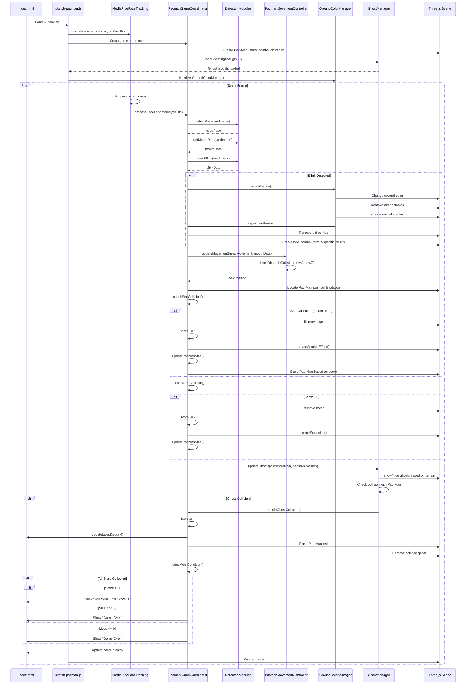
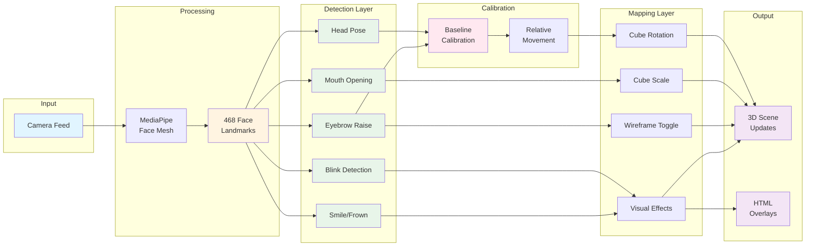

# Face Tracking System - UML Architecture

## Class Diagram


## Component Diagram

```mermaid
graph TB
    subgraph "External Dependencies"
        MP[MediaPipe FaceMesh]
        THREE[Three.js]
    end
    
    subgraph "Core Library (lib/)"
        MFT[MediaPipeFaceTracking]
    end
    
    subgraph "Detector Modules (modules/detectorModules/)"
        HPD[HeadPoseDetector]
        MD[MouthDetector]
        BD[BlinkDetector]
        ED[EyebrowDetector]
        SFD[SmileFrownDetector]
        CAL[CalibrationSystem]
    end
    
    subgraph "Example: Rotation (example_rotation/)"
        FTC1[FaceTrackingCoordinator]
        DM1[DataMapping]
        SO1[SceneObjects]
        SM1[sketch-modular.js]
        HTML1[index.html]
    end
    
    subgraph "Example: Movement (example_movement/)"
        FTC2[FaceTrackingCoordinator]
        DM2[DataMapping<br/>MovementController]
        SO2[SceneObjects]
        SM2[sketch-movement.js]
        SS2[sceneSetup.js]
        HTML2[index.html]
    end

    subgraph "Example: Pac-Man (example_pacman/)"
        FTC3[FaceTrackingCoordinator<br/>PacmanGameCoordinator]
        DM3[DataMapping<br/>PacmanMovementController<br/>GroundColorManager]
        SO3[SceneObjects<br/>PacmanGameObjects<br/>GhostManager]
        SM3[sketch-pacman.js]
        SS3[sceneSetup.js]
        HTML3[index.html]
        MODELS[Models/<br/>ghost.glb]
    end

    MP --> MFT
    THREE --> SO1
    THREE --> SO2
    THREE --> SO3    MFT --> FTC1
    MFT --> FTC2
    
    HPD --> FTC1
    MD --> FTC1
    BD --> FTC1
    ED --> FTC1
    SFD --> FTC1
    CAL --> FTC1
    
    HPD --> FTC2
    MD --> FTC2
    BD --> FTC2
    ED --> FTC2
    SFD --> FTC2
    CAL --> FTC2
    
    FTC1 --> DM1
    FTC1 --> SO1
    SM1 --> FTC1
    HTML1 --> SM1
    
    FTC2 --> DM2
    FTC2 --> SO2
    SM2 --> FTC2
    SS2 --> SM2
    HTML2 --> SM2

    FTC3 --> DM3
    FTC3 --> SO3
    SM3 --> FTC3
    SS3 --> SM3
    HTML3 --> SM3
    MODELS --> SO3

    style MP fill:#e1f5ff
    style THREE fill:#e1f5ff
    style MFT fill:#fff4e1
    style HPD fill:#e8f5e9
    style MD fill:#e8f5e9
    style BD fill:#e8f5e9
    style ED fill:#e8f5e9
    style SFD fill:#e8f5e9
    style CAL fill:#e8f5e9
    style MODELS fill:#ffe8f0
```## Sequence Diagram - Face Detection Flow

```mermaid
sequenceDiagram
    participant HTML as index.html
    participant Sketch as sketch-modular.js
    participant MP as MediaPipeFaceTracking
    participant Coord as FaceTrackingCoordinator
    participant Detectors as Detector Modules
    participant Calib as CalibrationSystem
    participant Mapping as DataMapping
    participant Scene as Three.js Scene
    
    HTML->>Sketch: Load & Initialize
    Sketch->>MP: initialize(video, canvas, onResults)
    Sketch->>Coord: Setup coordinator with detectors
    Sketch->>Scene: Create cube, camera, renderer
    
    loop Every Frame
        MP->>MP: Process video frame
        MP->>Coord: onFaceDetected(results)
        
        alt Calibration Phase
            Coord->>Detectors: detectPose(landmarks)
            Detectors-->>Coord: headPose
            Coord->>Detectors: calculateEyebrowDistance(landmarks)
            Detectors-->>Coord: eyebrowDistance
            Coord->>Calib: addSample(eyebrow, turn, tilt, roll)
            Calib-->>Coord: progress/isCalibrated
            Coord->>Scene: Keep cube neutral
        else Normal Operation
            Coord->>Detectors: detectPose(landmarks)
            Detectors-->>Coord: headPose
            Coord->>Detectors: getMouthData(landmarks)
            Detectors-->>Coord: mouthData
            Coord->>Detectors: detectBlink(landmarks)
            Detectors-->>Coord: blinkData
            Coord->>Detectors: detectExpression(landmarks, headPose)
            Detectors-->>Coord: expressionData
            Coord->>Detectors: detectRaise(landmarks, headPose)
            Detectors-->>Coord: eyebrowRaised
            
            Coord->>Calib: getHeadMovement(turn, tilt, roll)
            Calib-->>Coord: headMovement (relative to baseline)
            
            Coord->>Mapping: headPoseToCubeRotation(headMovement)
            Mapping-->>Coord: rotation
            Coord->>Mapping: mouthToCubeScale(mouthData)
            Mapping-->>Coord: scale
            Coord->>Mapping: eyebrowToWireframe(intensity)
            Mapping-->>Coord: wireframeOn
            
            Coord->>Scene: Update cube rotation/scale/wireframe
            Coord->>Mapping: onBlinkDetected(blinkData)
            Mapping->>Scene: Create circle effects
            Coord->>Mapping: onEyebrowRaise(eyebrowRaised)
            Mapping->>HTML: Create WOW text overlay
            Coord->>Mapping: onExpressionDetected(expressionData)
            Mapping->>HTML: Create emoji overlay
        end
    end
```

## Sequence Diagram - Pac-Man Game Flow



## Data Flow Diagram



## File Structure

```
TensorflowFaceModel/
├── lib/
│   ├── faceTrackingSystem.js          # MediaPipeFaceTracking class (MediaPipe wrapper)
│   └── faceDetectors.js               # Detector factory
│
├── modules/
│   └── detectorModules/
│       ├── headPoseDetection.js       # HeadPoseDetector class
│       ├── mouthDetection.js          # MouthDetector class
│       ├── blinkDetection.js          # BlinkDetector class
│       ├── eyebrowDetection.js        # EyebrowDetector class
│       ├── smileFrownDetection.js     # SmileFrownDetector class
│       └── calibration.js             # CalibrationSystem class
│
├── example_rotation/
│   ├── index.html                     # Main HTML page
│   ├── sketch-modular.js              # Entry point, scene setup
│   ├── faceTrackingCoordinator.js     # Coordinates all detectors
│   ├── dataMapping.js                 # Maps detections to cube actions
│   ├── sceneObjects.js                # Three.js objects creation
│   └── sceneSetup.js                  # Scene configuration
│
├── example_movement/
│   ├── index.html                     # Main HTML page
│   ├── sketch-movement.js             # Entry point, scene setup
│   ├── faceTrackingCoordinator.js     # Coordinates all detectors
│   ├── dataMapping.js                 # MovementController & mappings
│   ├── sceneObjects.js                # Three.js objects creation
│   └── sceneSetup.js                  # Scene configuration
│
├── example_pacman/
│   ├── index.html                     # Main HTML page with game UI
│   ├── sketch-pacman.js               # Game entry point, ghost loading
│   ├── faceTrackingCoordinator.js     # Game state coordination
│   ├── dataMapping.js                 # MovementController + GroundColorManager
│   ├── sceneObjects.js                # Pac-Man, stars, bombs, ghosts, obstacles
│   └── sceneSetup.js                  # Scene configuration
│
├── Models/                            # 3D model assets
│   ├── ghost.glb                      # Main ghost model used in game
│   ├── pac-man_ghost_blinky.glb       # Additional ghost variant
│   └── pacman_ghost_inky.glb          # Additional ghost variant
│
└── Legacy/
    ├── index.html                     # Original monolithic version
    └── sketch.js                      # Original monolithic code
```

## Key Design Patterns

### 1. **Modular Architecture**
- Each detector is a self-contained class with clear responsibilities
- Shared detectors in `modules/detectorModules/`
- Example-specific logic in separate folders

### 2. **Separation of Concerns**
- **Detection**: Raw data extraction from landmarks
- **Calibration**: Baseline establishment and relative movement
- **Mapping**: Converting detections to scene actions
- **Coordination**: Orchestrating the pipeline

### 3. **Data Flow**
1. MediaPipe → Landmarks (468 points)
2. Detectors → Typed data objects (HeadPose, MouthData, etc.)
3. Calibration → Relative movement from baseline
4. Mapping → Scene-specific actions
5. Scene → Visual updates

### 4. **Reusability**
- Same detector modules used in both examples
- Different mapping strategies for rotation vs movement
- Easy to create new examples with different mappings

### 5. **Smoothing & Filtering**
- Mouth: Sustained change detection + moving average
- Blink: Cooldown timer + state transition detection
- Eyebrow: Symmetry checking + intensity thresholding
- Calibration: Median of multiple samples

## Three Example Implementations

### 1. **example_rotation** - Cube Rotation Control
**Purpose**: Demonstrates basic face tracking with visual effects  
**Key Features**:
- Cube rotation controlled by head pose
- Cube scaling controlled by mouth opening
- Wireframe toggle via eyebrow raise
- Blink effects create expanding circles
- Smile/frown effects show emoji overlays

**Main Classes**:
- `RotationDataMapping`: Maps detections to cube transformations
- `BlinkEffectManager`: Creates circle effects on blinks
- `EyebrowEffectManager`: Shows "WOW" text on eyebrow raise
- `SmileFrownEffectManager`: Creates emoji overlays

### 2. **example_movement** - 3D Character Movement
**Purpose**: Demonstrates spatial movement and camera following  
**Key Features**:
- Character movement via head tilt (forward/back) and roll (strafe)
- Jumping controlled by mouth opening
- Camera follows character with smooth offset
- Physics-based velocity system

**Main Classes**:
- `MovementController`: Handles position, velocity, camera following
- `MovementDataMapping`: Maps head movement to velocity changes

### 3. **example_pacman** - Complete Face-Controlled Game
**Purpose**: Full-featured game demonstrating all tracking capabilities  
**Key Features**:
- Pac-Man movement (tilt=forward/back, roll=strafe+rotate, turn=camera)
- Mouth control for collecting stars
- Blink to switch between 4 terrains
- Collision detection with obstacles, stars, bombs, ghosts
- Lives system (3 hearts)
- Score tracking with visual effects
- Dynamic terrain system with specific challenges
- Ghost enemies (loaded from 3D models)
- Win/lose conditions

**Main Classes**:
- `PacmanMovementController`: Movement with obstacle collision
- `GroundColorManager`: Terrain switching and bomb repositioning
- `PacmanGameObjects`: Creates Pac-Man, stars, bombs, ghosts, obstacles
- `PacmanGameCoordinator`: Game state, collision detection, win/lose logic
- `GhostManager`: Ghost distribution, visibility, collision handling

**Game Mechanics**:
- 10 collectible stars (requires open mouth)
- Terrain-specific bomb counts (Desert=15, others=5)
- Terrain-specific ghost distribution (Sunset=3, Forest/Beach=1, Desert=0)
- Particle effects (sparkles for stars, explosions for bombs)
- Visual damage feedback (Pac-Man flashes red on ghost collision)
- Size scaling (Pac-Man grows with score)
