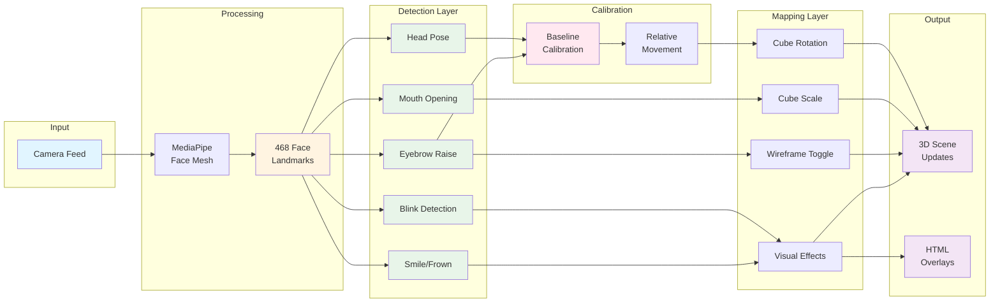

# Face Tracking System - UML Architecture

## Class Diagram

```mermaid
classDiagram
    %% Detector Modules
    class HeadPoseDetector {
        +detectPose(landmarks) HeadPose
    }
    
    class MouthDetector {
        -mouthOpenHistory: Array
        -lastSmoothedMouthValue: number
        +calculateMouthRatio(landmarks) number
        +smoothMouthOpening(rawValue) number
        +getMouthData(landmarks) MouthData
    }
    
    class BlinkDetector {
        -lastBlinkState: Object
        -lastBlinkTime: number
        +calculateEyeRatio(landmarks, eyePoints) number
        +detectBlink(landmarks) BlinkData
    }
    
    class EyebrowDetector {
        -eyebrowBaseline: number
        -headPoseBaselines: Object
        +setBaselines(eyebrowBaseline, headPoseBaselines)
        +calculateEyebrowDistance(landmarks) number
        +detectRaise(landmarks, headPose) boolean
    }
    
    class SmileFrownDetector {
        -headPoseBaselines: Object
        +setBaselines(headPoseBaselines)
        +detectExpression(landmarks, headPose) ExpressionData
    }
    
    class CalibrationSystem {
        -samples: Array
        -isCalibrated: boolean
        -eyebrowBaseline: number
        -headPoseBaselines: Object
        +addSample(eyebrow, turn, tilt, roll)
        +getProgress() number
        +getHeadPoseBaselines() Object
        +getHeadMovement(turn, tilt, roll) HeadMovement
        +shouldToggleWireframe(eyebrowDistance) boolean
    }
    
    %% Core Classes
    class MediaPipeFaceTracking {
        -faceMesh: FaceMesh
        -camera: Camera
        -onResultsCallback: Function
        +initialize(videoElement, canvasElement, onResults)
        +processResults(results, ctx, canvas)
    }
    
    class FaceTrackingCoordinator {
        -headPoseDetector: HeadPoseDetector
        -mouthDetector: MouthDetector
        -blinkDetector: BlinkDetector
        -eyebrowDetector: EyebrowDetector
        -smileFrownDetector: SmileFrownDetector
        -calibration: CalibrationSystem
        +onFaceDetected(results)
    }
    
    %% Data Mapping (Rotation Example)
    class RotationDataMapping {
        <<module>>
        +mouthToCubeScale(mouthData) number
        +headPoseToCubeRotation(headMovement) Rotation
        +eyebrowToWireframe(intensity) boolean
    }
    
    class BlinkEffectManager {
        -scene: Scene
        -circles: Array
        +onBlinkDetected(blinkData)
        +createCircle() Circle
        +updateCircles()
    }
    
    class EyebrowEffectManager {
        -lastWowTime: number
        +onEyebrowRaise(detected)
        +createWowText()
    }
    
    class SmileFrownEffectManager {
        -lastSmileTime: number
        -lastFrownTime: number
        +onExpressionDetected(expressionData)
        +createSmileyFace()
        +createFrownFace()
    }
    
    %% Movement Example Classes
    class MovementController {
        -position: Vector3
        -velocity: Vector3
        -cameraOffset: Vector3
        +updateMovement(headMovement, mouthData)
        +applyCameraFollow(camera)
    }

    class MovementDataMapping {
        <<module>>
        +applyHeadMovementToVelocity(controller, headMovement)
        +applyMouthToJump(controller, mouthData)
    }

    %% Pac-Man Game Classes
    class PacmanMovementController {
        -position: Vector3
        -velocity: Vector3
        -obstacles: Array
        -PACMAN_RADIUS: number
        +updateMovement(headMovement, mouthData)
        +checkObstacleCollision(newX, newZ) boolean
        +setObstacles(obstacles)
    }

    class GroundColorManager {
        -currentTerrain: number
        -terrainColors: Array
        -bombs: Array
        +switchTerrain()
        +getCurrentTerrain() number
        +repositionBombs()
    }

    class PacmanGameObjects {
        <<module>>
        +createPacman() Group
        +createStars(scene, count) Array
        +createBombs(scene, count, terrain) Array
        +loadGhosts(scene, count, modelPath) Promise
        +createObstacles(scene, terrainType) Array
        +removeObstacles(scene, obstacles)
    }

    class PacmanGameCoordinator {
        -score: number
        -lives: number
        -stars: Array
        -bombs: Array
        -ghosts: Array
        -pacman: Group
        +processFaceLandmarks(landmarks)
        +checkStarCollision()
        +checkBombCollision()
        +updatePacmanSize()
        +checkWinCondition()
        +createSparkleEffect()
        +createExplosion()
    }

    class GhostManager {
        -ghosts: Array
        -ghostsData: Array
        -currentTerrain: number
        +updateGhosts()
        +handleGhostCollision(pacmanPosition)
        +distributeGhostsToTerrains()
    }

    %% Scene Objects
    class SceneObjects {
        <<module>>
        +createCube() Mesh
        +createScene() Scene
        +createCamera() Camera
        +createRenderer() Renderer
    }
    
    %% Data Types
    class HeadPose {
        +turn: number
        +tilt: number
        +roll: number
    }
    
    class MouthData {
        +raw: number
        +smoothed: number
        +normalized: number
    }
    
    class BlinkData {
        +detected: boolean
        +leftRatio: number
        +rightRatio: number
    }
    
    class ExpressionData {
        +smile: Object
        +frown: Object
        +isSymmetrical: boolean
    }
    
    class HeadMovement {
        +turn: number
        +tilt: number
        +roll: number
    }
    
    %% Relationships - Rotation Example
    FaceTrackingCoordinator --> MediaPipeFaceTracking: uses
    FaceTrackingCoordinator --> HeadPoseDetector: uses
    FaceTrackingCoordinator --> MouthDetector: uses
    FaceTrackingCoordinator --> BlinkDetector: uses
    FaceTrackingCoordinator --> EyebrowDetector: uses
    FaceTrackingCoordinator --> SmileFrownDetector: uses
    FaceTrackingCoordinator --> CalibrationSystem: uses
    FaceTrackingCoordinator --> RotationDataMapping: uses
    
    RotationDataMapping --> BlinkEffectManager: creates
    RotationDataMapping --> EyebrowEffectManager: creates
    RotationDataMapping --> SmileFrownEffectManager: creates
    
    HeadPoseDetector ..> HeadPose: returns
    MouthDetector ..> MouthData: returns
    BlinkDetector ..> BlinkData: returns
    SmileFrownDetector ..> ExpressionData: returns
    CalibrationSystem ..> HeadMovement: returns
    
    %% Movement Example relationships
    MovementController --> MovementDataMapping: uses
    MovementDataMapping --> HeadMovement: consumes
    MovementDataMapping --> MouthData: consumes

    %% Pac-Man Game relationships
    PacmanGameCoordinator --> PacmanMovementController: uses
    PacmanGameCoordinator --> GroundColorManager: uses
    PacmanGameCoordinator --> PacmanGameObjects: uses
    PacmanGameCoordinator --> GhostManager: uses
    PacmanMovementController --> HeadMovement: consumes
    PacmanMovementController --> MouthData: consumes
    GroundColorManager --> BlinkData: consumes
    GhostManager --> PacmanGameObjects: uses
```



## Data Flow Diagram



## File Structure

```
TensorflowFaceModel/
├── lib/
│   ├── faceTrackingSystem.js          # MediaPipeFaceTracking class (MediaPipe wrapper)
│   └── faceDetectors.js               # Detector factory
│
├── modules/
│   └── detectorModules/
│       ├── headPoseDetection.js       # HeadPoseDetector class
│       ├── mouthDetection.js          # MouthDetector class
│       ├── blinkDetection.js          # BlinkDetector class
│       ├── eyebrowDetection.js        # EyebrowDetector class
│       ├── smileFrownDetection.js     # SmileFrownDetector class
│       └── calibration.js             # CalibrationSystem class
│
├── example_rotation/
│   ├── index.html                     # Main HTML page
│   ├── sketch-modular.js              # Entry point, scene setup
│   ├── faceTrackingCoordinator.js     # Coordinates all detectors
│   ├── dataMapping.js                 # Maps detections to cube actions
│   ├── sceneObjects.js                # Three.js objects creation
│   └── sceneSetup.js                  # Scene configuration
│
├── example_movement/
│   ├── index.html                     # Main HTML page
│   ├── sketch-movement.js             # Entry point, scene setup
│   ├── faceTrackingCoordinator.js     # Coordinates all detectors
│   ├── dataMapping.js                 # MovementController & mappings
│   ├── sceneObjects.js                # Three.js objects creation
│   └── sceneSetup.js                  # Scene configuration
│
├── example_pacman/
│   ├── index.html                     # Main HTML page with game UI
│   ├── sketch-pacman.js               # Game entry point, ghost loading
│   ├── faceTrackingCoordinator.js     # Game state coordination
│   ├── dataMapping.js                 # MovementController + GroundColorManager
│   ├── sceneObjects.js                # Pac-Man, stars, bombs, ghosts, obstacles
│   └── sceneSetup.js                  # Scene configuration
│
├── Models/                            # 3D model assets
│   ├── ghost.glb                      # Main ghost model used in game
│   ├── pac-man_ghost_blinky.glb       # Additional ghost variant
│   └── pacman_ghost_inky.glb          # Additional ghost variant
│
└── Legacy/
    ├── index.html                     # Original monolithic version
    └── sketch.js                      # Original monolithic code
```
